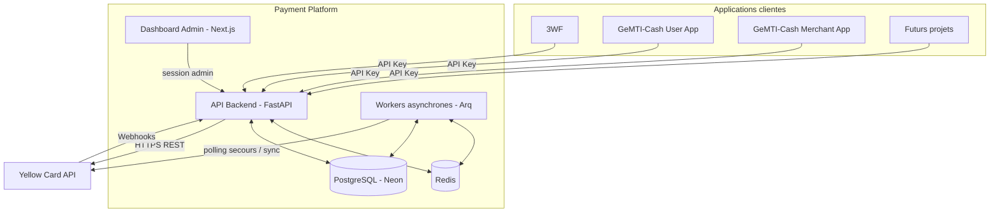
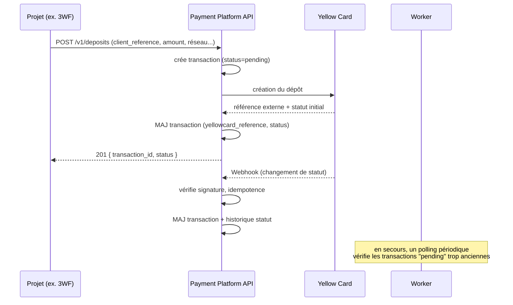
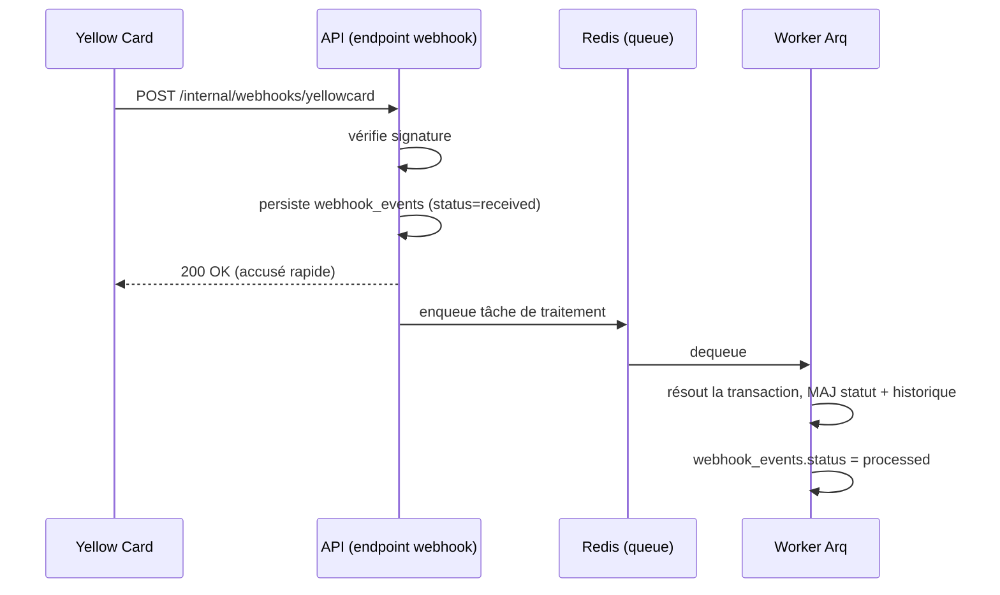

# Plan technique — Payment Platform

| | |
|---|---|
| **Version** | 1.0 |
| **Date** | 2026-07-24 |
| **Périmètre** | Backend API, Dashboard admin, Base de données, Intégration Yellow Card |
| **Référence** | Voir [Cahier des charges](./cahier-des-charges.md) |

---

## 1. Vue d'ensemble de l'architecture



**Principe d'architecture** : un seul service backend (API + logique métier), un pool de workers asynchrones pour tout ce qui ne doit pas bloquer une requête HTTP (traitement de webhook, synchronisation des référentiels, polling de secours), et un dashboard découplé qui consomme l'API via un espace `/admin` protégé.

## 2. Stack technique

| Couche | Choix | Justification |
|---|---|---|
| API Backend | **FastAPI** (Python, async) | Imposé, cohérent avec l'existant, natif OpenAPI. |
| ORM | **SQLAlchemy 2.0 (async)** + **Alembic** | Imposé ; Alembic pour les migrations versionnées. |
| Base de données | **PostgreSQL sur Neon** | Imposé. Serverless, branching, pooling intégré. |
| Driver DB | **asyncpg** via SQLAlchemy async engine | Compatible FastAPI async, performant. |
| Cache | **Redis** (Neon n'en fournit pas — instance managée séparée, ex. Upstash/Redis Cloud) | Cache des référentiels, rate limiting, file d'attente. |
| Tâches asynchrones | **Arq** (basé sur Redis, async-natif) | Plus léger que Celery, s'intègre naturellement à une stack FastAPI 100% async. |
| Dashboard | **Next.js + React + TypeScript** | Imposé. |
| Auth admin (dashboard) | Sessions JWT (httpOnly cookie) via l'API backend | Un seul système d'auth, pas de dépendance à un IdP externe au démarrage. |
| Documentation API | **OpenAPI/Swagger** (natif FastAPI) | Imposé, généré automatiquement. |
| Observabilité | Logs structurés (JSON) + Sentry (ou équivalent) pour les erreurs | Corrélation avec `error_logs` en base pour l'historique exploitable dans le dashboard. |

## 3. Structure du projet

Recommandation : **monorepo** unique `payment-platform/` (un seul produit, un seul cycle de vie, évite la dérive de versions entre API et dashboard).

```
payment-platform/
├── api/
│   ├── app/
│   │   ├── main.py
│   │   ├── core/            # config, sécurité, chiffrement, exceptions
│   │   ├── db/               # engine, session, base models
│   │   ├── models/           # modèles SQLAlchemy
│   │   ├── schemas/          # schémas Pydantic (request/response)
│   │   ├── repositories/     # accès aux données
│   │   ├── services/         # logique métier (deposit_service, webhook_service...)
│   │   ├── integrations/
│   │   │   └── yellowcard/   # client HTTP, auth, mapping DTO <-> modèles internes
│   │   ├── routers/
│   │   │   ├── v1/           # API publique projets (deposits, withdrawals, ...)
│   │   │   └── admin/        # API dashboard (protégée admin)
│   │   ├── webhooks/          # réception + vérification + dispatch
│   │   ├── workers/           # tâches Arq (sync référentiels, retry webhook)
│   │   └── middlewares/       # auth API key, rate limiting, logging
│   ├── alembic/
│   ├── tests/
│   └── pyproject.toml
├── admin-dashboard/
│   ├── app/                   # Next.js App Router
│   ├── components/
│   ├── lib/
│   └── package.json
├── docs/
│   ├── cahier-des-charges.md
│   ├── plan-technique.md
│   └── integration-guide.md   # guide d'intégration pour les équipes produit
└── infra/                     # docker-compose, IaC, CI/CD
```

## 4. Modèle de données

> Base hébergée sur **Neon**. Toutes les tables utilisent des UUID en clé primaire, `created_at`/`updated_at` en `timestamptz`.

### 4.1 `projects`
| Colonne | Type | Notes |
|---|---|---|
| id | uuid PK | |
| name | text | ex. "3WF" |
| slug | text unique | ex. "3wf" |
| description | text | |
| status | enum(active, inactive, suspended) | |
| environment | enum(sandbox, production) | un projet peut avoir un jeu de clés par environnement (voir 4.2) |
| created_at / updated_at | timestamptz | |

### 4.2 `api_keys`
| Colonne | Type | Notes |
|---|---|---|
| id | uuid PK | |
| project_id | uuid FK → projects | |
| key_prefix | text | partie visible affichée dans le dashboard |
| key_hash | text | secret hashé (argon2/bcrypt), jamais stocké en clair |
| scopes | jsonb | ex. `["deposits:write","withdrawals:write","transactions:read"]` |
| status | enum(active, revoked) | |
| last_used_at | timestamptz nullable | |
| expires_at | timestamptz nullable | |
| rotated_from_id | uuid nullable FK → api_keys | traçabilité de rotation |
| created_at | timestamptz | |

### 4.3 `yellowcard_credentials`

> L'API Yellow Card authentifie **chaque requête individuellement par signature HMAC-SHA256** (schéma `YcHmacV1` : `Authorization: YcHmacV1 {apiKey}:{signature}` + header `X-YC-Timestamp`), avec la clé API et le secret comme clé de signature. Il n'y a pas de jeton OAuth à obtenir ni à renouveler — donc pas de table `yellowcard_tokens` : la seule donnée à conserver est le couple clé/secret par environnement.

| Colonne | Type | Notes |
|---|---|---|
| id | uuid PK | |
| environment | enum(sandbox, production) | |
| api_key_encrypted | text | chiffré (voir §8.2) |
| api_secret_encrypted | text | chiffré, utilisé comme clé HMAC |
| base_url | text | |
| is_active | boolean | |
| created_at / updated_at | timestamptz | |

### 4.4 `countries`, `networks`, `currencies` (référentiels)
| Table | Colonnes clés | Notes |
|---|---|---|
| countries | id, yellowcard_id, name, iso_code, is_active, raw_data (jsonb), synced_at | |
| networks | id, yellowcard_id, country_id FK, name, code, channel_type, status, raw_data (jsonb), synced_at | Mobile Money / bank etc. |
| currencies | id, code, name, country_id FK, is_active | |

### 4.5 `transactions` (table pivot, `type` discriminant)
| Colonne | Type | Notes |
|---|---|---|
| id | uuid PK | |
| project_id | uuid FK → projects | rattachement obligatoire (NFE-09) |
| type | enum(deposit, withdrawal) | |
| reference | text unique | référence interne générée |
| client_reference | text nullable | référence fournie par le projet client (idempotency key) |
| yellowcard_reference | text nullable, indexé | id externe Yellow Card |
| status | enum(pending, processing, completed, failed, cancelled, expired) | |
| amount | numeric(18,2) | |
| currency_code | text | |
| country_id | uuid FK nullable | |
| network_id | uuid FK nullable | |
| customer_payload | jsonb | données minimales requises par Yellow Card (téléphone, nom) |
| request_payload | jsonb | ce qui a été envoyé à Yellow Card |
| response_payload | jsonb | dernière réponse brute connue |
| failure_reason | text nullable | |
| initiated_at | timestamptz | |
| completed_at | timestamptz nullable | |
| created_at / updated_at | timestamptz | |

Index recommandés : `(project_id, status)`, `(project_id, created_at)`, `yellowcard_reference`, unique `(project_id, client_reference)`.

> **Choix de conception** : une table unique `transactions` avec discriminant `type`, plutôt que deux tables `deposits`/`withdrawals` distinctes. Les deux flux partagent >90% des champs et du cycle de vie (statuts, historique, webhook). Les particularités propres à un retrait (ex. compte destinataire) vivent dans `request_payload`/`customer_payload` (jsonb), évitant une duplication de schéma et de requêtes. Le dashboard et l'API exposent des vues/endpoints distincts (`/deposits`, `/withdrawals`) qui filtrent sur `type`, donc l'exigence métier de section 5.3/5.4 du cahier des charges reste pleinement respectée côté produit.

### 4.6 `transaction_status_history`
| Colonne | Type | Notes |
|---|---|---|
| id | uuid PK | |
| transaction_id | uuid FK → transactions | |
| previous_status | text nullable | |
| new_status | text | |
| source | enum(webhook, polling, manual, system) | |
| payload | jsonb nullable | |
| created_at | timestamptz | |

### 4.7 `webhook_events`
| Colonne | Type | Notes |
|---|---|---|
| id | uuid PK | |
| event_type | text | |
| external_event_id | text unique | garantit l'idempotence (FE-22) |
| signature_valid | boolean | |
| raw_payload | jsonb | conservé même en cas d'échec (FE-20) |
| transaction_id | uuid FK nullable | résolu après traitement |
| status | enum(received, processing, processed, failed, ignored) | |
| processing_error | text nullable | |
| received_at | timestamptz | |
| processed_at | timestamptz nullable | |

### 4.8 `audit_logs`
| Colonne | Type | Notes |
|---|---|---|
| id | uuid PK | |
| actor_type | enum(admin, api_key, system) | |
| actor_id | text | |
| action | text | ex. `project.create`, `api_key.rotate` |
| resource_type | text | |
| resource_id | text | |
| before | jsonb nullable | |
| after | jsonb nullable | |
| ip_address | text nullable | |
| created_at | timestamptz | |

### 4.9 `error_logs`
| Colonne | Type | Notes |
|---|---|---|
| id | uuid PK | |
| source | enum(yellowcard_api, internal, webhook, sync, worker) | |
| level | enum(warning, error, critical) | |
| message | text | |
| context | jsonb | |
| stack_trace | text nullable | |
| resolved | boolean default false | |
| created_at | timestamptz | |

### 4.10 `system_settings`
| Colonne | Type | Notes |
|---|---|---|
| key | text PK | |
| value | jsonb | |
| description | text | |
| updated_at | timestamptz | |
| updated_by | text nullable | |

### 4.11 `admin_users`
| Colonne | Type | Notes |
|---|---|---|
| id | uuid PK | |
| email | text unique | |
| password_hash | text | argon2 |
| role | enum(super_admin, admin, viewer) | |
| is_active | boolean | |
| last_login_at | timestamptz nullable | |
| created_at | timestamptz | |

## 5. Authentification et sécurité

### 5.1 Authentification des projets clients → API interne

- Chaque projet dispose d'un couple **API Key (publique, préfixe visible) / API Secret (fourni une seule fois à la génération)**.
- Flux recommandé : le projet client échange son couple clé/secret contre un **token JWT de courte durée (15 min)** via `POST /v1/auth/token` (grant type client_credentials). Le JWT porte `project_id` et `scopes`.
- Les appels suivants utilisent `Authorization: Bearer <jwt>`.
- Le `key_hash` en base est haché (jamais le secret en clair). Rotation via `rotated_from_id` pour audit.
- Rate limiting par projet (Redis, sliding window) pour éviter qu'un projet ne consomme excessivement l'API.

### 5.2 Authentification Yellow Card

- L'API Yellow Card (Business API) authentifie **chaque requête indépendamment** par signature HMAC-SHA256 (schéma `YcHmacV1`), il n'y a pas de jeton à obtenir ni à rafraîchir.
- Chaîne signée : `timestamp` (ISO8601 + `Z`) + `path` (ex. `/business/channels`) + `method` (ex. `GET`), concaténés dans cet ordre puis passés à `hmac.new(secret, ..., sha256)` ; si un corps JSON est présent **et compte plus d'une clé**, `base64(sha256(json.dumps(body)))` est ajouté à la chaîne avant calcul final. La signature finale est encodée en base64.
- Headers envoyés : `X-YC-Timestamp: <timestamp>` et `Authorization: YcHmacV1 <apiKey>:<signature>`.
- Le client `integrations/yellowcard/client.py` (`YellowCardClient`) encapsule entièrement ce calcul, de façon **transparente pour le reste du code métier** (les services appellent `yellowcard_client.get(...)`/`post(...)`, jamais de logique de signature dupliquée). Vérifié en conditions réelles contre le sandbox le 24/07/2026 (`GET /business/channels` → 200).
- Échec d'authentification (401, signature rejetée) → `error_logs` (source=`yellowcard_api`, level=`critical`) + alerte visible dans le dashboard.

### 5.3 Chiffrement des secrets

- `api_secret` (projets) : haché, jamais déchiffrable (comme un mot de passe).
- `yellowcard_credentials` (clé API + secret Yellow Card) : **chiffrés at-rest** (Fernet/AES-GCM) avec une clé de chiffrement applicative stockée hors base (variable d'environnement / secret manager), distincte de la base Neon elle-même.

### 5.4 Vérification des webhooks

- Vérification de la signature/entête fournie par Yellow Card (selon spécification Sandbox) avant tout traitement.
- Webhook non authentifiable → enregistré avec `signature_valid=false`, **non traité**, visible dans le dashboard pour investigation.
- Idempotence garantie par `external_event_id` unique.

### 5.5 Rôles admin (RBAC)

| Rôle | Droits |
|---|---|
| `viewer` | Lecture seule (dashboard, transactions, webhooks). |
| `admin` | + gestion des projets, clés API, retraitement de webhook. |
| `super_admin` | + gestion des admins, paramètres système, credentials Yellow Card. |

## 6. Conception de l'API

### 6.1 Espace `/v1` — API publique projets clients

| Méthode | Route | Description |
|---|---|---|
| POST | `/v1/auth/token` | Échange API Key/Secret contre un JWT court |
| GET | `/v1/countries` | Liste des pays disponibles |
| GET | `/v1/countries/{id}/networks` | Réseaux Mobile Money par pays |
| GET | `/v1/currencies` | Devises supportées |
| POST | `/v1/deposits` | Initier un dépôt |
| GET | `/v1/deposits/{id}` | Détail / statut d'un dépôt |
| GET | `/v1/deposits` | Liste/recherche des dépôts du projet |
| POST | `/v1/withdrawals` | Initier un retrait |
| GET | `/v1/withdrawals/{id}` | Détail / statut d'un retrait |
| GET | `/v1/withdrawals` | Liste/recherche des retraits du projet |
| GET | `/v1/transactions/{id}` | Détail transaction (union deposit/withdrawal) |
| GET | `/v1/transactions` | Recherche/filtre transversal |

Toutes les routes de création acceptent une `client_reference` (idempotency key) pour éviter les doublons en cas de retry côté client.

### 6.2 Espace interne webhooks

| Méthode | Route | Description |
|---|---|---|
| POST | `/internal/webhooks/yellowcard` | Point de réception unique des webhooks Yellow Card |

### 6.3 Espace `/admin/v1` — Dashboard (auth session admin)

| Domaine | Routes principales |
|---|---|
| Auth | `POST /admin/v1/auth/login`, `POST /admin/v1/auth/logout` |
| Dashboard | `GET /admin/v1/stats/overview`, `GET /admin/v1/stats/by-project` |
| Transactions | `GET /admin/v1/transactions`, `GET /admin/v1/transactions/{id}` |
| Projets | `GET/POST /admin/v1/projects`, `PATCH /admin/v1/projects/{id}` |
| Clés API | `POST /admin/v1/projects/{id}/api-keys`, `POST /admin/v1/api-keys/{id}/rotate`, `POST /admin/v1/api-keys/{id}/revoke` |
| Webhooks | `GET /admin/v1/webhooks`, `POST /admin/v1/webhooks/{id}/reprocess` |
| Monitoring | `GET /admin/v1/monitoring/health`, `GET /admin/v1/monitoring/errors` |
| Audit | `GET /admin/v1/audit-logs` |
| Settings | `GET/PATCH /admin/v1/settings` |

Documentation générée automatiquement (OpenAPI/Swagger) et publiée à `/docs` (interne uniquement, protégée en production).

## 7. Flux principaux

### 7.1 Dépôt



### 7.2 Traitement d'un webhook



Le endpoint webhook répond **immédiatement** (accusé de réception) puis délègue le traitement au worker, pour ne jamais bloquer Yellow Card et absorber les pics.

## 8. Base de données Neon — spécificités

- **Connexion applicative** : utiliser l'endpoint **pooled** de Neon (PgBouncer intégré, mode `transaction`) pour l'API (beaucoup de connexions courtes, compatible serverless/autoscaling).
- **Migrations (Alembic)** : utiliser l'endpoint **direct (non pooled)**, car les migrations DDL et certains verrous ne sont pas compatibles avec le mode transaction du pooler.
- **Branching Neon** : exploiter les branches Neon pour créer une base éphémère par environnement de preview/CI (ex. une branche par PR), évitant de polluer la base Sandbox partagée.
- **Autosuspend** : désactiver ou allonger l'autosuspend sur la branche de production (le cold start d'une base suspendue introduit une latence sur la première requête, inacceptable pour un endpoint de paiement synchrone).
- **Sauvegardes** : s'appuyer sur le point-in-time restore natif de Neon ; documenter la procédure de restauration dans le guide d'exploitation.
- **Secrets de connexion** : les chaînes de connexion Neon (pooled/direct) sont stockées en variables d'environnement / secret manager, jamais committées.

## 9. Cache et tâches asynchrones (Redis + Arq)

| Usage | Détail |
|---|---|
| Cache référentiels | `countries`, `networks`, `currencies` en cache Redis (TTL long, invalidé à la sync) pour servir l'API sans aller en base à chaque appel. |
| Rate limiting | Compteur par `project_id` (sliding window). |
| File de traitement webhook | Queue Arq dédiée, avec retry exponentiel et dead-letter (webhook en échec après N tentatives → visible dans le dashboard pour reprocess manuel). |
| Jobs planifiés | Synchronisation référentiels (cron quotidien), polling de secours des transactions "pending" anciennes (cron court). |

## 10. Observabilité

- **Logs structurés (JSON)** sur toutes les couches (API, workers), avec `request_id`/`transaction_id` de corrélation.
- **`error_logs`** en base = source de vérité exploitable dans le dashboard (pas seulement un outil externe).
- **Sentry** (ou équivalent) en complément pour les alertes temps réel et les stack traces détaillées.
- **Health checks** : `/health` (liveness) et `/health/ready` (readiness, incluant vérification DB/Redis/Yellow Card reachability) pour le monitoring d'infra.
- **Indicateur de disponibilité Yellow Card** : basé sur le taux d'échec récent des appels sortants, affiché dans l'écran monitoring du dashboard.

## 11. Environnements

| Environnement | Base Neon | Yellow Card | Usage |
|---|---|---|---|
| Local/dev | Branche Neon dev ou Postgres local | Sandbox | Développement quotidien |
| CI / Preview | Branche Neon éphémère par PR | Sandbox | Tests automatisés, review |
| Staging | Branche Neon staging | Sandbox | Recette avant intégration produit |
| Production | Branche Neon production (autosuspend désactivé) | Production | Trafic réel |

## 12. Roadmap de mise en œuvre

### Phase 0 — Fondations
- Initialisation du monorepo, CI/CD, conteneurisation.
- Provisionnement Neon (branches dev/staging/prod), Redis.
- Squelette FastAPI + Alembic + modèles de base.
- Client Yellow Card : signature HMAC des requêtes (Sandbox) — **fait**, vérifié en conditions réelles.

### Phase 1 — MVP fonctionnel
- Synchronisation des référentiels (pays/réseaux/devises).
- Endpoints dépôts/retraits + suivi de statut.
- Réception et traitement des webhooks (avec idempotence).
- Gestion basique des projets et clés API (via script/admin minimal).
- Journalisation des erreurs.
- Dashboard minimal : login, liste des transactions, liste des projets.

→ Correspond aux critères d'acceptation de la section 10 du cahier des charges.

### Phase 2 — Dashboard complet
- Tableau de bord (statistiques, activité par projet).
- Gestion complète des projets et rotation de clés depuis l'UI.
- Écran webhooks (statuts, reprocess manuel).
- Journal d'audit consultable.
- RBAC admin complet.

### Phase 3 — Durcissement
- Écran monitoring (disponibilité Yellow Card, erreurs, performance).
- Rate limiting en production, tests de charge.
- Revue de sécurité (secrets, endpoints sensibles, permissions).
- Finalisation de la documentation (OpenAPI + guide d'intégration produit + guide d'exploitation).
- Bascule Sandbox → Production Yellow Card.

### Phase 4 — Onboarding produits
- Intégration 3WF (remplacement de tout appel direct existant, s'il y en a).
- Intégration GeMTI-Cash (app utilisateur puis app marchand).
- Onboarding des futurs projets : **aucune nouvelle intégration Yellow Card**, uniquement une déclaration de projet + clé API.

## 13. Risques et points de vigilance

| Risque | Mitigation |
|---|---|
| Cold start Neon en production | Désactiver l'autosuspend sur la branche prod ; surveiller la latence. |
| Divergence de statut entre webhook et réalité Yellow Card | Polling de secours périodique sur les transactions restées `pending` au-delà d'un seuil. |
| Webhook dupliqué ou rejoué | Idempotence stricte via `external_event_id`. |
| Fuite de secrets (Yellow Card, JWT) | Chiffrement at-rest, secrets hors dépôt de code, rotation possible. |
| Un projet client sature l'API | Rate limiting par projet dès le MVP si possible, sinon Phase 3 au plus tard. |
| Dérive vers du multi-provider prématuré | Rappel explicite (cahier des charges §3.2) : aucune abstraction provider avant qu'un second fournisseur soit réellement décidé. |
